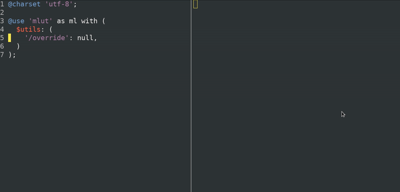

# My Little UI Toolkit #


[](https://travis-ci.com/mr150/mlut)
[](https://www.npmjs.com/package/mlut)

Atomic CSS toolkit with Sass and ergonomics for creating styles of any complexity. <br> Get almost all power of CSS in one utility!

## Table of Contents
- [Features](#features)
	- 🔠 [Strong naming convention](#strong-naming-convention)
	- 🎨 [Almost arbitrary by design](#almost-arbitrary-by-design)
	- ✋ [Great ergonomics](#great-ergonomics)
	- 🔨 [Easiest utils generation](#easiest-utils-generation)
	- 🧩 [Handy extension](#handy-extension)
	- 👀 [And also...](#and-also)
- [Structure](#structure)
	- [Library](#library)
	- [Tools](#tools)
	- [Addons](#addons)
- [Getting Started](#getting-started)
	- [Installation](#installation)
	- [Usage](#usage)
- [Documentation](#documentation)
- [What next](#what-next)
- [Acknowledgement](#acknowledgement)
- [License](#license)



## Features

### Strong naming convention
❌ **Tailwindcss**:
- `.justify-*`: content, items or self?
- `.flex` => `display: flex`, but `.flex-auto` => `flex: 1 1 auto;`
- `.bg-none` - reset all background? Nope, only `background-image`

❌ **Tachyons**:
- `.br-0` => `border-right-width: 0`, but `.br1` => `border-radius:.125rem`
- `.normal`: line-height, font-weight or letter-spacing?
- `.b`: bottom, border or `display: block`? Nope, it is `font-weight:bold`!

✅ **mlut**:
- `.Jc-c` => `justify-content: center`, `.Js-c` => `justify-self: center`
- `.Bdr` => `border-right: 1px solid`, `.Bdrd1` => `border-radius: 1px`

[One algorithm](https://mr150.github.io/mlut/section-concepts.html#kssref-concepts-naming) for all. If you know CSS, you almost know mlut.

### Almost arbitrary by design
- [values](https://mr150.github.io/mlut/section-concepts.html#kssref-concepts-values): `.Ml-1/7` => `margin-left: -14.3%`
- [states](https://mr150.github.io/mlut/section-concepts.html#kssref-concepts-states): `Bgc-red200_h,f` => `.Bgc-red200_h\,f:hover, .Bgc-red200_h\,f:focus {...}`
- [at-rules](https://mr150.github.io/mlut/section-concepts.html#kssref-concepts-at_rules): `@:p-c,w>=80r_D-f` => `@media (pointer: coarse), (min-width: 90rem) {...}`

### Great ergonomics
Shorter class names:
```html
<!-- Example from https://www.shopify.com/ -->

<!-- Tailwindcss -->
<div class="hidden md:block md:col-span-6 md:col-start-7 lg:col-span-5 lg:col-start-8 pb-6 relative md:max-h-[130vh] reduced-motion:translate-y-0 will-change-transform duration-1000 ease-in-out transition-all reduced-motion:opacity-100">...</div>

<!-- mlut -->
<div class="D-n md_D md_Gc-s1 md_Gcs7 lg_Gc-s5 lg_Gcs8 Pb6su Ps md_Mxh130vh Tf @:pfrm_-Try0 Wlc-tf Tsd1s Tstf-eio Ts-all @:pfrm_O1">...</div>
```
Convenient syntax for complex values, states and at-rules. It is like Vim for CSS.
#### ❌ Tailwindcss:
- `[@media(any-hover:hover){&:hover}]:opacity-100`
- `text-[color:var(--my-var,#333)]`
- `supports-[margin:1svw]:ml-[1svw]`

#### ✅ mlut:
- `@:ah_O1_h` => `@media (any-hover) { .\@\:ah_O1_h:hover { opacity: 1 } }`
- `C-$myVar?#333` => `color: var(--ml-myVar, #333)`
- `@s_Ml1svw` => `@supports (margin-left: 1svw) { .\@s_Ml1svw { margin-left: 1svw } }`


### Easiest utils generation

JIT mode planned but here is what we have now:

#### Range [syntaxes](https://mr150.github.io/mlut/section-how_to.html#kssref-how_to-mk_utils-range)

<table>
<tr>
<th>Sass</th>
<th>CSS</th>
</tr>
<tr>
<td valign="top">

```scss
@use 'mlut' with (
  $utils: (
    'Bdw': ([2su, 4],),
  )
);
```

</td>
<td valign="top">

```scss
.Bdw2su {
  border-width: 0.5rem;
}

.Bdw3su {
  border-width: 0.75rem;
}

.Bdw4su {
  border-width: 1rem;
}
```

</td>
</tr>
</table>

#### Components syntax
<table>
<tr>
<th>Sass</th>
<th>CSS</th>
</tr>
<tr>
<td valign="top">

```scss
@use 'mlut' with (
  $utils: (
    'D': ('xl _ib_ b af'),
  )
);
```

</td>
<td valign="top">

```scss
.D-ib {
  display: inline-block;
}

.D-ib_b::before {
  display: inline-block;
}

.D-ib_af::after {
  display: inline-block;
}

@media (min-width: 1200px) {
  .xl_D-ib {
    display: inline-block;
  }
}
```

</td>
</tr>
</table>

#### Groups
<table>
<tr>
<th>Sass</th>
<th>CSS</th>
</tr>
<tr>
<td valign="top">

```scss
@use 'mlut' with (
  $utils: (
    'Paddings': (150),
  )
);
```

</td>
<td valign="top">

```scss
.P150 {
  padding: 150px;
}

.Pt150 {
  padding-top: 150px;
}

.Pr150 {
  padding-right: 150px;
}

// etc.
```

</td>
</tr>
</table>

#### Top-level apply
<div class="Ov-a W100p">
<table>
<tr>
<th>Sass</th>
<th>CSS</th>
</tr>
<tr>
<td valign="top">

```scss
@include ml.apply(
  '^0:+_-MyPad1.5;3su -Gdl-r,#0f0;30p,#00f;80p,red'
);
```

</td>
<td valign="top">

```scss
.-Ctx0 + .\^0\:\+_-MyPad1\.5\;3su {
  --ml-myPad: 1.5rem 0.75rem;
}

.-Gdl-r\,\#0f0\;30p\,\#00f\;80p\,red {
  background-image: linear-gradient(to right, #0f0 30%, #00f 80%, red);
}
```

</td>
</tr>
</table>
</div>

### Handy extension
Add utilities, states and custom at-rules with few lines of code
```scss
@use 'mlut' as ml with (
  // add utilities
  $utils-data: (
    'utils': (
      'registry': (
        'Mil': margin-inline,
        'Ir': (
          'properties': image-rendering,
          'keywords': (
            'p': pixelated,
          ),
        ),
      ),
    ),
  ),

  // add states
  $utils-config: (
    'states': (
      'custom': (
        'are': '[aria-expanded=“true”]',
      ),
    ),
  ),
);

@include ml.apply('Mil-15_-are Ir-p');

// CSS

.Mil-15_-are[aria-expanded=“true”] {
  margin-inline: -15px;
}

.Ir-p {
  image-rendering: pixelated;
}
```

### And also...
- ⚡️ Written in [Sass](https://www.sass-lang.com/) and includes all its benefits
- 🔧 **Fully customizable**: change tokens, utilities names and any settings
- ✨ **Easy to integrate** in existing project. No name collisions with your CSS in the most projects. Increasing specificity in [one line](https://mr150.github.io/mlut/section-settings.html#kssref-settings-utils-other-up_specificity) or for [one](https://mr150.github.io/mlut/section-concepts.html#kssref-concepts-states-special-tu) utility.

## Structure ##
- Sass tools
- opt-in CSS library
- addons

### Library ###
The library part of toolkit named `Core` and consists of:

- base styles - variables and generic CSS like reset, normalize etc.
- helpers - similar to utilities: the same universal, but more complex and can consist of several CSS rules
- utilities - such that can be used in any project, regardless of design: no colors, typography, etc. Theme utils you can find in addons

The library is **modular** and you can include only what you need

### Tools ###
Sass tools include:

- settings based on which the everything works 
- mixins and functions with which you can generate utilities and write styles

### Addons ###
Addons may contains any tools, utilities and styles. In the `core/utils/init.scss` module implemented a method to work with sets of utilities from addons. Addons now at the **preview** stage and in the future, may be moved to separate packages

## Getting Started ##
There are 2 ways to start using mlut:

- assembled distributive
- toolkit

### Installation ###

#### NPM ####
```
npm i mlut -D
```

#### CDN ####
Only core:
```html
<link href="https://unpkg.com/mlut@latest/dist/mlut.min.css" rel="stylesheet">
```
or with Demo theme included:
```html
<link href="https://unpkg.com/mlut@latest/dist/mlut-demo-theme.min.css" rel="stylesheet">
```

### Usage ###

#### Distributive ####

You can get assembled mlut code and include it to your project. There are some ways to get a distributive.

- just plug in with CDN
- if used `npm`, files are in `node_modules/mlut/dist/`

Add the files to your page like here:
```html
<link href="css/mlut.min.css" rel="stylesheet">
```
And just add classes to markup:
```html
<div class="D-g Gtc-t3">
  <div class="Bd P2su">
    <h3>Simple text</h3>
```

#### Toolkit ####
To use all mlut features you need an assembly. You will need to install a package via NPM and:

- [Dart Sass](https://github.com/sass/sass), and in particular [sass-embedded](https://www.npmjs.com/package/sass-embedded) for better performance
- CSS minifier or PostCSS plugin that can group media queries. For example: [CSSO](https://github.com/css/csso) or [this](https://github.com/SassNinja/postcss-combine-media-query) plugin
- [PurgeCSS](https://github.com/FullHuman/purgecss) is recommended for removing unused CSS

Once the assembly is configured, just import mlut to your stylesheet, and configure it as you need:
```scss
@use '../../node_modules/mlut' as ml with (
  $su: 5px,
  $breakpoints: (
    'xxl': 1400px
  ),
  $colors: (
    'red0': #f20,
  ),
  $utils: (
    '^_D': ('', 'n', 'f'),
  ),
);
```
Also now you can use Sass tools for writing CSS manually:
```scss
.my-card {
  display: block;

  @include ml.apply(
    'P2su Fns1r'
  );

  @include ml.bp('md') {
    font-size: calc(ml.px2rem(20px) + 1vw);
  }
}
```
Probably you want to set the Sass [load path](https://sass-lang.com/documentation/js-api/interfaces/LegacyFileOptions#includePaths) for easier import:
```scss
@use 'mlut' as ml with (
```

## Documentation ##
Available [here](https://mr150.github.io/mlut/) or can be run locally. Documentation is included in this repo and is generated using [KSS-node](https://github.com/kss-node/kss-node) from the comments in the sources.

## What next? ##
- CLI
- JIT mode
- first class CSS functions in utils values
- and much more!

## Acknowledgement ##
- [CSS](https://www.w3.org/Style/CSS/)
- [Emmet](https://github.com/emmetio)
- [ACSS](https://acss.io/)
- [Tailwind CSS](https://tailwindcss.com/)
- [Tachyons](https://tachyons.io/)

## License ##
MIT
